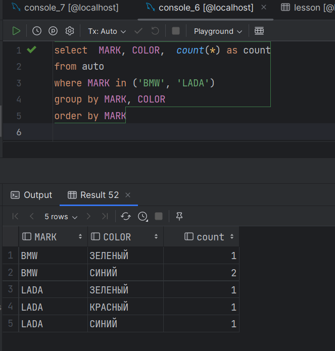
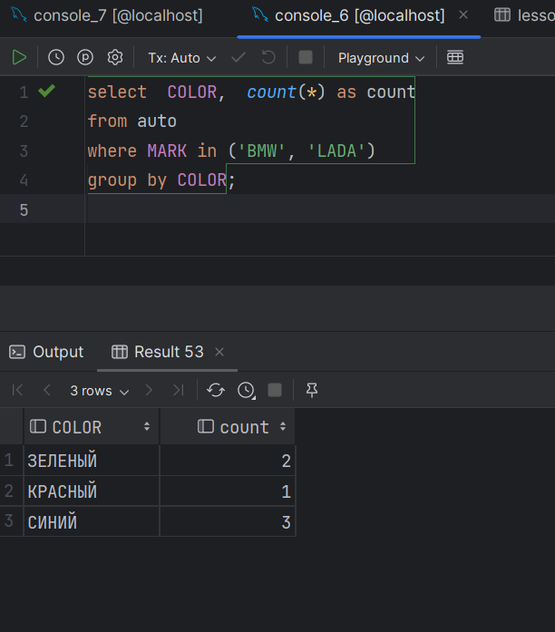
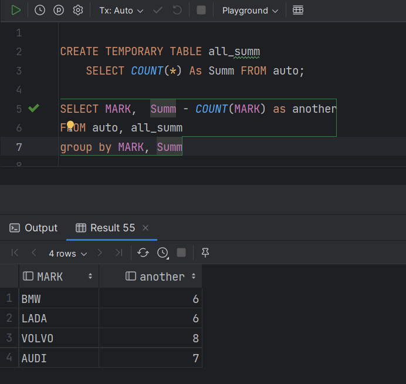
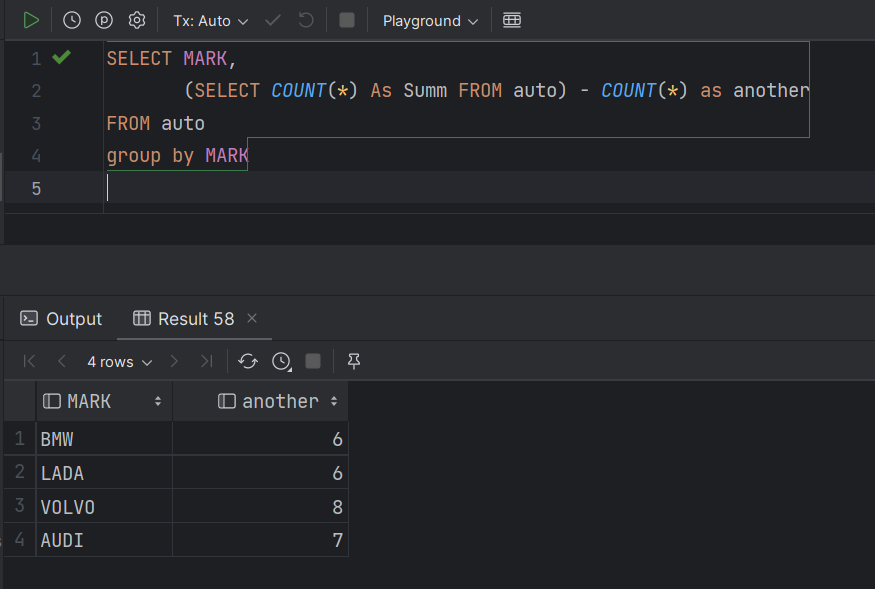
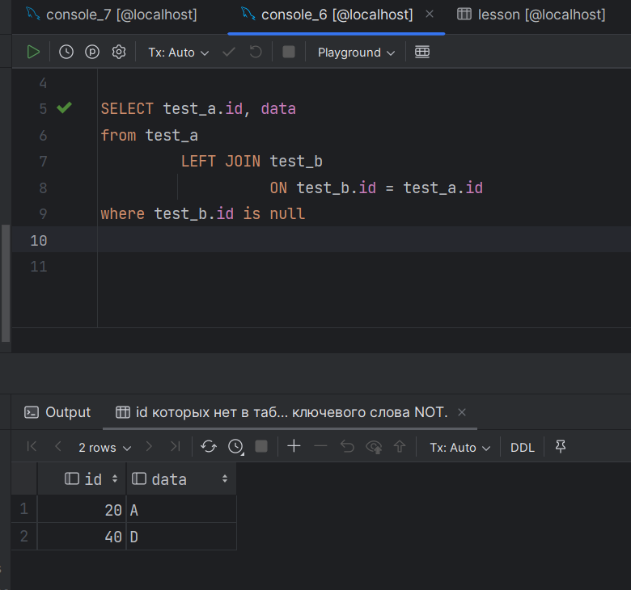

Условие:
Табличка:
https://drive.google.com/file/d/1PQn576YVakvlWrIgIjSP9YEf5id4cqYs/view?usp=sharing
1. Вывести на экран сколько машин каждого цвета для машин марок BMW и LADA

         Не очень понял условие задачи - попробовал вот такие два разных запроса 

2. Вывести на экран марку авто и количество AUTO не этой марки
   
         тоже чуть по-разному попробовал

 

   Задание №3.
   Даны 2 таблицы, созданные следующим образом:
   create table test_a (id number, data varchar2(1));
   create table test_b (id number);
   insert into test_a(id, data) values
   (10, 'A'),
   (20, 'A'),
   (30, 'F'),
   (40, 'D'),
   (50, 'C');
   insert into test_b(id) values
   (10),
   (30),
   (50);
   Напишите запрос, который вернет строки из таблицы test_a, id которых нет в таблице test_b, НЕ используя ключевого слова NOT.
   
